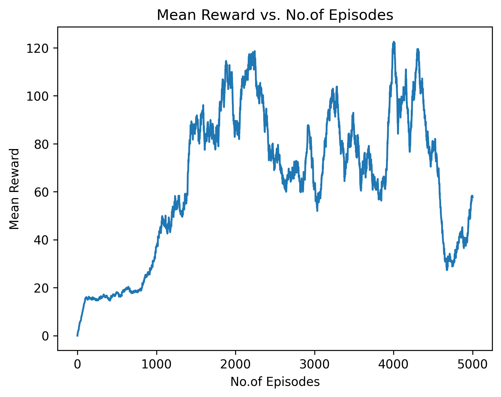
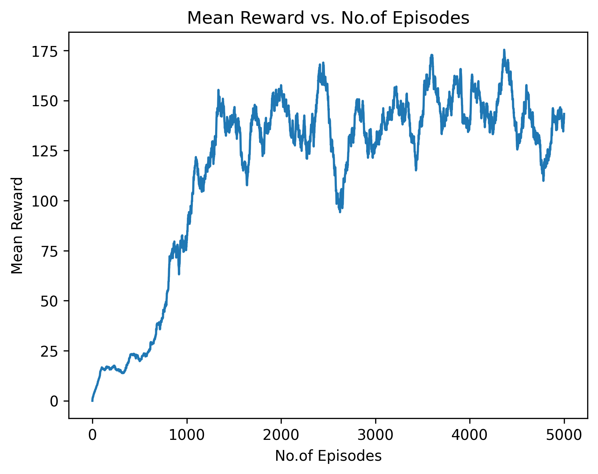
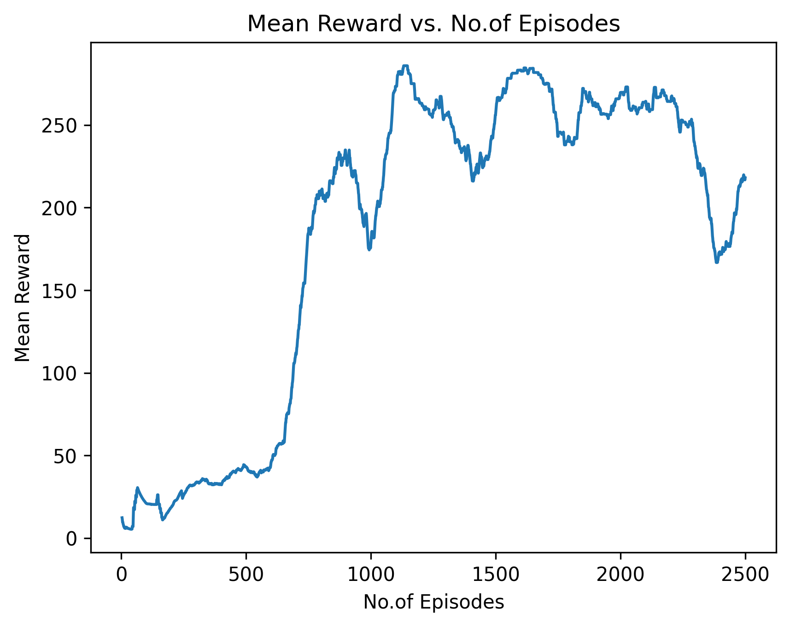
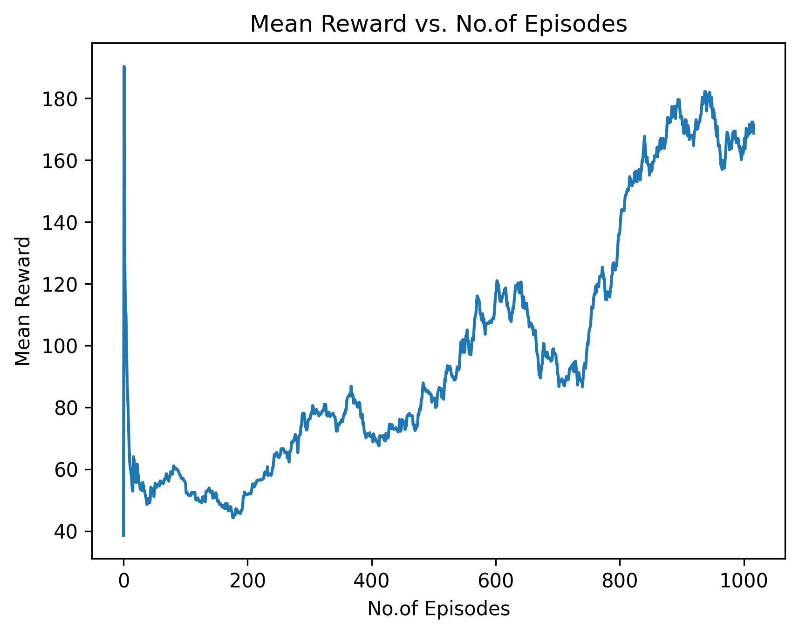

# Deep Reinforcement Learning for Decision Making in Autonomous Driving
Course Project for DS595/CS525 - Reinforcement Learning (Fall 2022)
Master of Science in Robotics Engineering at [Worcester Polytechnic Institute](https://www.wpi.edu/)

This repository implements deep reinforcement learning algorithms for decision making in autonomous driving highway environment. We have used [highway-env](https://highway-env.readthedocs.io/en/latest/) as our environment and implemented DQN, DDDQN, DDPG and PPO algorithm for decision making. More information about working and can be found [here](https://github.com/ranebhushan/cs525_project/tree/main/docs/document).

## Contents
- Deep Reinforcement Learning for Decision Making in Autonomous Driving
  - [1. Team Members](#1-team-members)
  - [2. Dependencies](#2-dependencies)
  - [3. Repository Setup](#3-repository-setup)
  - [4. Setting The Configurations](#4-setting-the-configurations)
    - [i.  Environment Configurations](#i-environment-configurations)
    - [ii. Agent Configurations](#ii-agent-configurations)
  - [5. Run Training](#5-run-training)
  - [6. Run Testing](#6-run-testing)
  - [7. Output](#7-output)
    - [i.  Videos](#i-videos)
    - [ii. Training Plots](#ii-training-plots)

## Team Members
- [Amey Anil Deshpande](https://github.com/AmeyDeshpande97)
- [Bhushan Ashok Rane](https://github.com/ranebhushan)
- [Denny Boby](https://github.com/dennyboby)
- [Yash Rajendra Patil](https://github.com/patilyashr)

## Dependencies
- OS : [Ubuntu 20.04 LTS](https://releases.ubuntu.com/20.04/)
- Python : [3.9.13](https://www.python.org/downloads/release/python-3913/)
- PyTorch : [1.13.0](https://pytorch.org/)
- OpenAI Gym : [0.26.2](https://www.gymlibrary.dev/)

## Repository Setup
In order to setup the repository locally on your system, open a new terminal and follow the instructions below:

    cd ~
    python3 -m venv rl_project
    source ~/rl_project/bin/activate
    git clone git@github.com:ranebhushan/cs525_project.git
    cd ~/cs525_project/
    mkdir {weights,logs}
    pip install -r requirements.txt

## Setting The Configurations
Before starting the training, the right configuration needs to be set in the config file. Following sections explain how to set them up.

### Environment Configurations
This section explains how to configure the highway environment. Running the following command will take you to the environment config file.

    cd ~/cs525_project/
    vi configs/highway-env_config.json

Here you can set the configurations required for the environment. More details of the configurations are provided in this [link](https://highway-env.readthedocs.io/en/latest/quickstart.html#configuring-an-environment). We trained our code for the values set in the config file.

### Agent Configurations
This section explains how to configure the parameters for the agent. DQN, DDDQN, DDPG Running the following command will take you to the environment config file.

    cd ~/cs525_project/
    vi configs/<algorithm_name>.yaml # Eg: vi configs/DQN.yaml

The algorithm_name can be the DQN, DDDQN, DDPG and PPO. Make sure to set `train` to `True` in the yaml for training.

## Run Training
This section explains how to run the training code. Once the configuration is set, to run the training, run the following command.

    cd ~/cs525_project/
    ./run.sh <algorithm_name> # Eg: ./run.sh DDDQN

`Point to note:` The weights are stored in `weights` folder with date/time and model name. The logs are saved in `logs` folder with same date/time and model name in csv format.

## Run Testing
This section explains how to run the testing code. Once the configuration is set, to run the test, run the following command.
Make sure to set `train` to `False` in the yaml for testing.

    cd ~/cs525_project/
    ./run.sh <algorithm_name> # Eg: ./run.sh DDDQN

## Output
This section shows the output performance of the algorithms.

### Videos

| **DQN** https://user-images.githubusercontent.com/44564963/206376512-077cf56a-ef74-4dc5-8aef-c9a5ca7aef8e.mp4 | **DDDQN** https://user-images.githubusercontent.com/44564963/206376630-006774c7-4f95-4b37-b996-64f93856dc52.mp4 |
|-----------------|------------------|
| **DDPG**  https://user-images.githubusercontent.com/44564963/206376766-f89ee071-7fe4-4bf3-aff2-a2c8fd99b128.mp4 | **PPO**  https://user-images.githubusercontent.com/44564963/206376797-ee0210c7-a7c2-4efb-9374-20a1def8a64e.mp4   |

https://github.com/ranebhushan/cs525_project/blob/main/docs/videos/DDDQN-2022-12-06_15.33.44.mp4

### Training Plots

| **DQN**  | **DDDQN**  |
|-----------------|------------------|
| **DDPG**  | **PPO**    |
